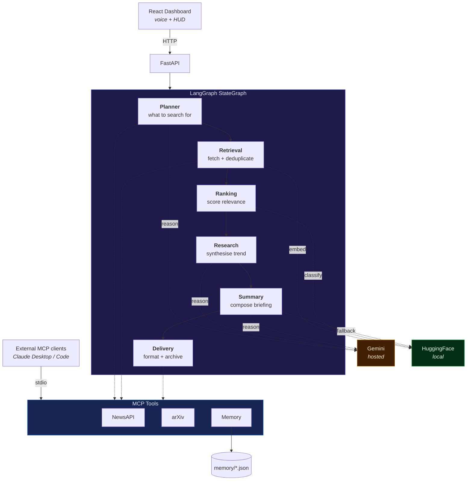

<div align="center">

# J.A.R.V.I.S.

**A multi-agent AI intelligence briefing system.**

Six specialised agents, orchestrated with LangGraph, retrieve and rank the day's
AI news and research through Model Context Protocol tools, then synthesise a
technical briefing — using hosted reasoning where it earns its cost and local
models everywhere else.

[](https://github.com/Hobzzz99/JARVIS/actions/workflows/ci.yml)
[](https://www.python.org/)
[](https://react.dev/)
[](https://fastapi.tiangolo.com/)
[](https://langchain-ai.github.io/langgraph/)
[](https://modelcontextprotocol.io/)
[](LICENSE)

[Quick start](#quick-start) · [Architecture](#architecture) · [API](#api-reference) · [MCP server](#mcp-server) · [Testing](#testing) · [Design notes](docs/ARCHITECTURE.md)

</div>

---

## What it does

Every run, JARVIS plans what to look for, pulls live articles and arXiv
preprints, removes stories that are the same event reported twice, scores what
remains against your interests, and writes a briefing with a "why it matters"
section — then archives it so tomorrow's plan avoids repeating today's angles.

The dashboard drives all of this from the browser, including a voice interface:
say *"compile briefing"* and the pipeline runs.

## Highlights

| | |
|---|---|
| **Six-agent pipeline** | LangGraph `StateGraph` with per-node timing instrumentation |
| **MCP server** | 7 tools over stdio — usable from Claude Desktop, Claude Code, or any MCP host |
| **Hybrid inference** | Gemini for reasoning; MiniLM, BART-MNLI and BART-CNN locally for embedding, ranking and fallback summarisation |
| **Degrades, never dies** | Zero credentials and zero network still produce a briefing — and say so |
| **Real telemetry** | The dashboard shows actual per-agent execution times, not animated placeholders |
| **Tested** | 47 hermetic tests; CI runs lint, format, tests, frontend build and a Docker build |
| **Free to run** | Every external service used has a no-cost tier; arXiv needs no key at all |

---

## Architecture



### The agents

| # | Agent | Engine | Responsibility |
|---|---|---|---|
| 1 | **Planner** | Gemini | Reads preferences and recent briefings; emits search queries that avoid repeating covered ground. Falls back to a preference-derived plan. |
| 2 | **Retrieval** | MCP tools | Fans out news and arXiv queries across a thread pool, then deduplicates — exact titles first, semantic embeddings second. |
| 3 | **Ranking** | BART-MNLI *(local)* | Zero-shot classification scores every article against your focus topics in one batched forward pass. |
| 4 | **Research** | Gemini | Identifies the dominant trend across news and papers, and why it matters to someone building systems. |
| 5 | **Summary** | Gemini → BART *(local)* → template | Composes the briefing. Three strategies in descending order of quality; one always succeeds. |
| 6 | **Delivery** | — | Formats the terminal banner, archives to memory, logs the event. |

### Why it's built this way

The short version: **free tiers change without warning** — Google retired
`gemini-2.0-flash` during development — so no single external dependency is
allowed to be load-bearing. Every stage has a fallback, and degraded output is
labelled rather than passed off as the real thing.

The long version, including why six agents beat one prompt, why MCP is an
integration boundary rather than an internal abstraction, and what flat-JSON
persistence still has to get right: **[docs/ARCHITECTURE.md](docs/ARCHITECTURE.md)**.

---

## Tech stack

| Layer | Technology | Cost |
|---|---|---|
| Orchestration | LangGraph `StateGraph` | Free |
| Hosted reasoning | Google Gemini (`google-genai` SDK) | Free tier |
| Local ranking | `facebook/bart-large-mnli` | Free / on-device |
| Local embeddings | `all-MiniLM-L6-v2` | Free / on-device |
| Local summarisation | `facebook/bart-large-cnn` | Free / on-device |
| Tool protocol | Model Context Protocol | Free |
| News | NewsAPI | Free — 100 req/day |
| Research | arXiv API | Free — no key |
| Backend | FastAPI + Uvicorn + Pydantic v2 | Free |
| Frontend | React 19 + TypeScript + Tailwind v4 + Vite | Free |
| Persistence | Atomic JSON stores | Free |
| Quality | pytest, ruff, ESLint, GitHub Actions | Free |

---

## Quick start

### Prerequisites

- Python 3.10+
- Node.js 18+
- ~2 GB free disk for HuggingFace weights (downloaded on first use)

### 1. Install

```bash
git clone https://github.com/Hobzzz99/JARVIS.git
cd JARVIS

python -m venv .venv
source .venv/bin/activate          # Windows: .venv\Scripts\activate
pip install -r requirements.txt

cd frontend && npm install && cd ..
```

### 2. Configure

```bash
cp .env.example .env
```

**Both keys are optional.** With neither set, JARVIS runs entirely on local
models and serves clearly-labelled sample articles — the full pipeline still
executes end to end.

| Variable | Where to get it | Cost |
|---|---|---|
| `GEMINI_API_KEY` | [aistudio.google.com/app/apikey](https://aistudio.google.com/app/apikey) | Free |
| `NEWS_API_KEY` | [newsapi.org/register](https://newsapi.org/register) | Free (100/day) |
| arXiv | No key required | Free |

> **Never commit `.env`.** It is git-ignored by default. If a key has ever been
> committed anywhere, rotate it — git history is public and permanent.

### 3. Run

```bash
# Terminal 1 — backend
uvicorn api.main:app --reload --port 8000

# Terminal 2 — dashboard
cd frontend && npm run dev
```

Open **http://localhost:5173**. Interactive API docs are at
**http://localhost:8000/docs**.

### Or run the pipeline directly

```bash
python -m workflows.daily_briefing
```

Prints the briefing to your terminal and archives it — no server, no frontend.

### Or with Docker

```bash
cp .env.example .env               # fill in keys, or leave blank for offline
docker compose up --build
```

Model weights persist in a named volume, so only the first run pays the
download cost.

---

## Configuration

All settings resolve through one place: `config.get_settings()`.

<details>
<summary><b>Full environment variable reference</b></summary>

| Variable | Default | Description |
|---|---|---|
| `GEMINI_API_KEY` | — | Gemini credential. Empty ⇒ offline reasoning. |
| `GEMINI_MODEL` | `gemini-flash-latest` | Auto-updating alias; pin an exact id for reproducibility. |
| `NEWS_API_KEY` | — | NewsAPI credential. Empty ⇒ labelled sample articles. |
| `HF_RANKING` | `true` | Rank articles with the local zero-shot classifier. |
| `HF_SUMMARIZER` | `false` | Force local BART summarisation instead of Gemini. |
| `PRELOAD_MODELS` | `true` | Warm local models in a background thread at API startup. |
| `HF_CLASSIFIER_MODEL` | `facebook/bart-large-mnli` | Ranking model. |
| `HF_SUMMARIZER_MODEL` | `facebook/bart-large-cnn` | Summarisation model. |
| `HF_EMBEDDING_MODEL` | `all-MiniLM-L6-v2` | Embedding model for dedup. |
| `MAX_NEWS_QUERIES` | `3` | News queries executed per run. |
| `MAX_PAPER_QUERIES` | `2` | arXiv queries executed per run. |
| `NEWS_PAGE_SIZE` | `10` | Articles requested per news query. |
| `PAPERS_PER_QUERY` | `4` | Papers requested per arXiv query. |
| `DEDUP_THRESHOLD` | `0.85` | Cosine similarity above which two headlines are the same story. |
| `MAX_RANKED_ARTICLES` | `8` | Articles kept after ranking. |
| `LLM_MAX_RETRIES` | `2` | Retries for transient 429/503 responses. |
| `API_HOST` / `API_PORT` | `0.0.0.0` / `8000` | Server bind address. |
| `CORS_ORIGINS` | `http://localhost:5173,…` | Comma-separated allowed browser origins. |
| `LOG_LEVEL` | `INFO` | Root log level. |

Frontend: set `VITE_API_BASE` in `frontend/.env` (default
`http://localhost:8000`). It must match `API_PORT`, and the dashboard's origin
must appear in `CORS_ORIGINS`.

</details>

### Running fully offline

```env
GEMINI_API_KEY=
NEWS_API_KEY=
HF_SUMMARIZER=true
```

Every stage now runs on-device. Output is marked `Local BART` and the feed is
marked `[SAMPLE]`, so degraded results are never mistaken for live ones.

---

## API reference

Base URL `http://localhost:8000` · OpenAPI at `/docs`

| Method | Endpoint | Description |
|---|---|---|
| `GET` | `/` | Service metadata and capability flags |
| `GET` | `/health` | Liveness probe |
| `POST` | `/briefing` | Run the full six-agent workflow |
| `GET` | `/history?limit=10` | Recent archived briefings |
| `GET` | `/logs?limit=50` | Recent workflow events |
| `GET` | `/preferences` | Read the operator profile |
| `PUT` | `/preferences` | Update the operator profile |
| `POST` | `/chat` | Single-turn chat with the JARVIS persona |

<details>
<summary><b>Example requests and responses</b></summary>

**Capability check**

```bash
curl http://localhost:8000/
```

```json
{
  "status": "Jarvis online",
  "llm": "gemini-flash-latest",
  "gemini_enabled": true,
  "news_api_enabled": true,
  "hf_ranking": true,
  "hf_summarizer": false,
  "offline_mode": false
}
```

**Run a briefing** — takes tens of seconds; minutes on a cold model cache.

```bash
curl -X POST http://localhost:8000/briefing
```

```json
{
  "briefing": "━━━━━━━━\nJARVIS — AI INTELLIGENCE BRIEF\n2026-08-19 // Operator: Mohab\n…",
  "articles": [
    {
      "title": "…",
      "description": "…",
      "url": "https://…",
      "source": "…",
      "published": "2026-08-19T10:00:00Z",
      "relevance_score": 0.9182,
      "top_topic": "Agentic AI",
      "is_sample": false
    }
  ],
  "papers": [{ "title": "…", "summary": "…", "url": "https://arxiv.org/abs/…", "authors": ["…"] }],
  "insights": "…",
  "focus_topics": ["AI Engineering", "MCP", "Agentic AI"],
  "telemetry": [
    { "node": "planner",   "seconds": 1.15,  "status": "ok" },
    { "node": "retrieval", "seconds": 26.05, "status": "ok" },
    { "node": "ranking",   "seconds": 8.42,  "status": "ok" },
    { "node": "research",  "seconds": 3.10,  "status": "ok" },
    { "node": "summary",   "seconds": 4.77,  "status": "ok" },
    { "node": "delivery",  "seconds": 0.48,  "status": "ok" }
  ],
  "duration_seconds": 43.97
}
```

**Chat**

```bash
curl -X POST http://localhost:8000/chat \
  -H "Content-Type: application/json" \
  -d '{"message":"Systems check, JARVIS."}'
```

```json
{
  "response": "All primary systems are green and functioning within optimal parameters, Sir.",
  "source": "gemini"
}
```

`source` is `"fallback"` when the rule-based local responder answered.

**Update preferences**

```bash
curl -X PUT http://localhost:8000/preferences \
  -H "Content-Type: application/json" \
  -d '{"name":"Mohab","interests":["Agentic AI","MCP"],"favorite_sources":["Hugging Face"]}'
```

</details>

---

## MCP server

The retrieval and memory tools are exposed over the Model Context Protocol, so
any MCP host can use JARVIS's capabilities without importing its code.

```bash
python -m jarvis_mcp.server
```

| Tool | Description |
|---|---|
| `fetch_ai_news` | Latest English-language AI articles from NewsAPI |
| `fetch_ai_papers` | Most recent arXiv preprints for a query |
| `load_preferences` | Read the operator profile |
| `save_preferences` | Persist the operator profile |
| `save_briefing` | Append a briefing to the archive |
| `get_recent_briefings` | Last N briefings, for topic-repetition avoidance |
| `get_workflow_logs` | Last N workflow events |

**Claude Code**

```bash
claude mcp add jarvis -- python -m jarvis_mcp.server
```

**Claude Desktop** — merge [`mcp.config.example.json`](mcp.config.example.json)
into `claude_desktop_config.json`, replacing the placeholder path.

---

## Project structure

```
JARVIS/
├── config.py                  Single source of configuration + logging setup
│
├── agents/                    The six pipeline stages
│   ├── planner_agent.py       Decides what to search for
│   ├── retrieval_agent.py     Fetches and deduplicates
│   ├── ranking_agent.py       Scores relevance locally
│   ├── research_agent.py      Synthesises the cross-source trend
│   ├── summary_agent.py       Composes the briefing (3-tier fallback)
│   └── delivery_agent.py      Formats, archives, logs
│
├── workflows/
│   └── daily_briefing.py      LangGraph StateGraph + timing instrumentation
│
├── jarvis_mcp/                Model Context Protocol server
│   ├── server.py              TOOL_REGISTRY — one definition per tool
│   └── tools/
│       ├── news_tool.py       NewsAPI + labelled offline sample data
│       ├── arxiv_tool.py      arXiv preprints
│       └── memory_tool.py     Atomic, self-healing JSON persistence
│
├── llm/
│   ├── gemini_client.py       google-genai wrapper: retries, typed errors
│   └── hf_client.py           Lazy, lock-guarded local model loading
│
├── api/
│   └── main.py                FastAPI app: 8 endpoints, Pydantic schemas
│
├── frontend/                  React 19 + TypeScript + Tailwind v4 dashboard
│   └── src/
│       ├── App.tsx            Dashboard component
│       ├── api.ts             Typed backend client
│       ├── types.ts           Mirrors the Pydantic response models
│       └── constants.ts       Categories, filters, voice configuration
│
├── memory/                    Runtime JSON stores (git-ignored)
├── tests/                     47 hermetic tests
├── docs/ARCHITECTURE.md       Design decisions and trade-offs
├── Dockerfile                 Non-root image with healthcheck
└── docker-compose.yml         Persistent memory + model cache volumes
```

---

## Testing

```bash
pip install -r requirements-dev.txt

pytest                      # 47 tests
pytest --cov                # with coverage
ruff check . && ruff format --check .

cd frontend && npm run lint && npm run build
```

Tests are **hermetic** — no API keys, no network calls, no model downloads. The
`isolated_env` fixture sets `JARVIS_SKIP_DOTENV=1` and redirects memory to a
temp directory, so your real `.env` and briefing archive are never touched.

Coverage focuses on the behaviour that matters:

- **Every fallback path.** Each test forces the primary engine to fail and
  asserts the fallback still produced usable output.
- **Secret handling.** Masked keys never contain the raw value; the NewsAPI key
  is asserted to travel as a header, never in a URL or query string.
- **Persistence edge cases.** Corrupted JSON self-heals, writes leave no temp
  files behind, the workflow log stays bounded.
- **Malformed LLM output.** Fenced JSON, prose-wrapped JSON, partially valid
  plans and responses containing no JSON at all.
- **HTTP contract.** Every endpoint, including validation rejections and the
  500 path.

---

## Roadmap

- [ ] Vector memory — embeddings already exist for dedup; reuse them so the
      planner retrieves *semantically related* past briefings instead of the
      last three by recency
- [ ] Multi-turn chat backed by `conversation_memory.json`
- [ ] Scheduled runs (cron / APScheduler) with email or webhook delivery
- [ ] Embedding-based category filters, replacing keyword substring matching
- [ ] Streaming briefing output over SSE for live token display
- [ ] API authentication and per-client rate limiting for non-localhost use

---

## Acknowledgements

Built with [LangGraph](https://langchain-ai.github.io/langgraph/),
[Model Context Protocol](https://modelcontextprotocol.io/),
[Google Gemini](https://ai.google.dev/),
[HuggingFace Transformers](https://huggingface.co/docs/transformers),
[Sentence Transformers](https://sbert.net/),
[FastAPI](https://fastapi.tiangolo.com/) and [arXiv](https://arxiv.org/).

## License

[MIT](LICENSE)

---

<div align="center">

**Mohab Ahmed** — AI Engineer & Agentic Systems Developer

[](https://github.com/Hobzzz99)

</div>
